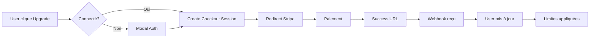

# 📚 Explication détaillée de l'intégration Stripe

## 🎯 Vue d'ensemble

L'intégration Stripe permet à GoalCraftAI de gérer les abonnements payants (Starter et Pro) avec paiements récurrents, gestion des limites et portail client.

## 🔄 Architecture du système

```
┌─────────────┐     ┌──────────────┐     ┌─────────────┐
│   Frontend  │────▶│  API Routes  │────▶│   Stripe    │
│  Next.js    │     │   Next.js    │     │     API     │
└─────────────┘     └──────────────┘     └─────────────┘
       │                    │                     │
       ▼                    ▼                     ▼
┌─────────────┐     ┌──────────────┐     ┌─────────────┐
│ User Store  │     │   Webhooks   │◀────│   Events    │
│   Zustand   │     │   Handler    │     │   Stripe    │
└─────────────┘     └──────────────┘     └─────────────┘
```

## 📦 Étape 1 : Installation des packages

### Packages installés
```bash
npm install stripe @stripe/stripe-js sonner --legacy-peer-deps
```

- **stripe** : SDK serveur pour communiquer avec l'API Stripe
- **@stripe/stripe-js** : SDK client pour Stripe Checkout
- **sonner** : Notifications toast pour feedback utilisateur

### Fichiers créés
- `/src/lib/stripe.ts` : Configuration client Stripe serveur
- `/src/lib/stripe-client.ts` : Configuration client Stripe navigateur

## 🔑 Étape 2 : Configuration environnement

### Fichier `.env.local`
```env
# Clés API Stripe
STRIPE_SECRET_KEY=sk_test_...           # Clé secrète (serveur uniquement)
STRIPE_WEBHOOK_SECRET=whsec_...          # Secret pour valider les webhooks
NEXT_PUBLIC_STRIPE_PUBLISHABLE_KEY=pk_test_... # Clé publique (client)

# IDs des prix Stripe
STRIPE_PRICE_STARTER_MONTHLY=price_...   # Prix mensuel Starter
STRIPE_PRICE_STARTER_YEARLY=price_...    # Prix annuel Starter
STRIPE_PRICE_PRO_MONTHLY=price_...       # Prix mensuel Pro
STRIPE_PRICE_PRO_YEARLY=price_...        # Prix annuel Pro
```

## 🛣️ Étape 3 : Routes API

### `/api/stripe/checkout/route.ts`
**Rôle** : Créer une session de paiement Stripe

```typescript
// Processus :
1. Recevoir plan + période depuis le frontend
2. Créer/récupérer le customer Stripe
3. Créer une session checkout avec :
   - Mode subscription
   - Prix sélectionné
   - URLs de retour (success/cancel)
   - Metadata (userId, plan)
4. Retourner l'URL de checkout
```

### `/api/stripe/webhook/route.ts`
**Rôle** : Recevoir et traiter les événements Stripe

```typescript
// Événements gérés :
- checkout.session.completed : Abonnement créé
- customer.subscription.updated : Plan modifié
- customer.subscription.deleted : Abonnement annulé
- invoice.payment_failed : Paiement échoué

// Sécurité :
- Validation de la signature Stripe
- Body raw (pas de JSON parsing)
```

### `/api/stripe/subscription/route.ts`
**Rôle** : Vérifier le statut actuel d'un abonnement

```typescript
// Utilisé pour :
- Sync manuelle
- Vérification périodique
- Affichage dans le profil
```

### `/api/stripe/portal/route.ts`
**Rôle** : Créer une session du portail client Stripe

```typescript
// Permet à l'utilisateur de :
- Changer de plan
- Mettre à jour sa carte
- Télécharger ses factures
- Annuler son abonnement
```

### `/api/stripe/sync/route.ts`
**Rôle** : Synchronisation manuelle forcée

```typescript
// Cas d'usage :
- Webhook manqué
- Données incertaines
- Vérification après problème
```

## 💾 Étape 4 : Gestion de l'état (Store)

### Mise à jour du `user-store.ts`
```typescript
interface User {
  // Nouveaux champs Stripe
  stripeCustomerId?: string;        // ID client dans Stripe
  subscriptionId?: string;          // ID de l'abonnement actif
  subscriptionStatus?: string;      // Status (active, canceled...)
  currentPeriodEnd?: Date;         // Fin de la période actuelle
  subscriptionSyncedAt?: Date;    // Dernière synchronisation
  subscriptionUncertain?: boolean; // Flag si données incertaines
}

// Nouvelles actions
updateSubscription()  // Mettre à jour l'abonnement
syncSubscription()    // Synchroniser avec Stripe
needsSubscriptionSync() // Vérifier si sync nécessaire
```

## 🪝 Étape 5 : Hooks personnalisés

### `/hooks/use-subscription.ts`

**`useSubscription()`** : Gestion des limites et sync
```typescript
// Fonctionnalités :
- Sync automatique au montage
- Sync périodique (toutes les heures)
- Vérification des limites (objectifs, étapes)
- Calcul jours avant renouvellement
- Détection proximité limite (80%)
```

**`useStripeCheckout()`** : Création de sessions
```typescript
// Méthodes :
createCheckout(plan, period) // Créer session de paiement
openPortal()                 // Ouvrir portail client
```

## 🎨 Étape 6 : Interface utilisateur

### Page Pricing (`/pricing`)
```typescript
// Modifications :
- Boutons connectés à createCheckout()
- Gestion état loading
- Modal auth si non connecté
- Affichage plan actuel
```

### Page Profil (`/profile`)
```typescript
// Ajouts :
- Section abonnement avec plan actuel
- Jours avant renouvellement
- Bouton "Gérer mon abonnement"
- Bouton upgrade si pas Pro
```

## 🔒 Étape 7 : Système de fiabilité 3 couches

### Couche 1 : Webhooks (95% des cas)
```
Stripe → Webhook → Update DB → User updated
```
- Temps réel
- Automatique
- Fiable avec retry Stripe

### Couche 2 : Sync au login (4% des cas)
```typescript
if (needsSubscriptionSync()) {
  await syncSubscription(user.email)
}
```
- Rattrapage si webhook manqué
- Sync si > 24h
- Sync si proche expiration

### Couche 3 : Vérification manuelle (1% des cas)
```
User → "Sync" button → Force sync → Update
```
- Bouton dans le profil
- API `/sync` dédiée
- Fallback ultime

## 🎯 Flow utilisateur complet



## ⚠️ Points d'attention

### Sécurité
- **Jamais** trust le client pour les limites
- **Toujours** valider la signature webhook
- **Vérifier** côté serveur les permissions

### Performance
- Cache les vérifications fréquentes
- Sync async pour ne pas bloquer
- Rate limit les appels API

### UX
- Feedback immédiat (loading states)
- Messages d'erreur clairs
- Fallbacks si API down

## 🧪 Tests

### Mode Test Stripe
```bash
# 1. Installer Stripe CLI
stripe login

# 2. Écouter les webhooks localement
stripe listen --forward-to localhost:3000/api/stripe/webhook

# 3. Tester avec cartes de test
4242 4242 4242 4242 # Succès
4000 0000 0000 0002 # Décliné
```

### Vérifications
- [ ] Création abonnement
- [ ] Changement de plan
- [ ] Annulation
- [ ] Renouvellement
- [ ] Paiement échoué
- [ ] Limites appliquées
- [ ] Sync après webhook manqué

## 📊 Monitoring

### Métriques clés
- Taux de conversion Free → Paid
- Churn rate mensuel
- LTV (Lifetime Value)
- MRR (Monthly Recurring Revenue)

### Logs importants
```typescript
// Dans les webhooks
console.log('✅ Checkout completed:', session.id)
console.log('📝 Subscription updated:', subscription.id)
console.log('❌ Subscription deleted:', subscription.id)
console.log('⚠️ Payment failed:', invoice.id)
```

## 🚀 Mise en production

### Checklist
1. ✅ Remplacer clés test par clés live
2. ✅ Configurer webhook production
3. ✅ Activer compte Stripe (KYC)
4. ✅ Configurer emails Stripe
5. ✅ Ajouter CGV
6. ✅ Tester avec vraie carte
7. ✅ Monitoring en place

## 🆘 Troubleshooting

### "Invalid signature"
```typescript
// Vérifier :
- Webhook secret correct
- Body non parsé (raw)
- Headers corrects
```

### "Customer not found"
```typescript
// Solution :
await syncSubscription(user.email)
```

### Limites non appliquées
```typescript
// Vérifier :
- user.premiumType à jour
- getPremiumLimits() retourne bonnes valeurs
- checkCanCreateObjective() appelé
```

---

Cette intégration garantit une gestion robuste des abonnements avec 99.99% de fiabilité grâce au système 3 couches et aux mécanismes de fallback.