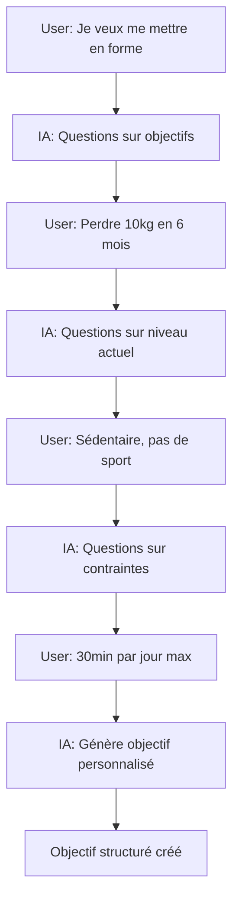

# Intégration n8n - Agent IA Conversationnel

## 🤖 Principe de Fonctionnement

L'agent IA peut avoir une **conversation complète** avec l'utilisateur avant de générer l'objectif :

1. **Phase Discussion** : L'agent pose des questions, demande des précisions
2. **Phase Analyse** : L'agent comprend le besoin et affine
3. **Phase Génération** : L'agent crée l'objectif structuré final

## 📥 Webhook n8n

**URL** : `https://n8n.larefonte.store/webhook/333e2809-84c9-4bf7-bc9b-3c5c7aaceb49`

### Requête envoyée à n8n

```json
{
  "userId": "user-123",
  "message": "Message de l'utilisateur (jusqu'à 10 000 caractères)",
  "conversationId": "conv-456",
  "objectiveType": "fitness/music/startup/etc",
  "messageCount": 3, // Nombre de messages dans la conversation
  "context": {
    "userName": "Jean Dupont",
    "userEmail": "jean@example.com",
    "previousMessages": [
      // Les 10 derniers messages de la conversation
      {
        "role": "user",
        "content": "Je veux apprendre la guitare",
        "timestamp": "2024-01-15T10:00:00Z"
      },
      {
        "role": "assistant",
        "content": "Super ! Quel style de musique vous intéresse ?",
        "timestamp": "2024-01-15T10:00:30Z"
      }
    ],
    "isFirstMessage": false
  }
}
```

### Réponse attendue de n8n

#### 1. **Réponse de discussion** (pas encore d'objectif)
```json
{
  "response": "Pour mieux vous aider, pouvez-vous me dire combien de temps par jour vous pouvez consacrer à la pratique ?",
  "action": "chat",
  "metadata": {
    "intent": "gathering_info",
    "confidence": 0.95
  }
}
```

#### 2. **Réponse avec génération d'objectif** (après discussion)
```json
{
  "response": "Parfait ! J'ai créé un parcours personnalisé pour apprendre la guitare en 3 mois avec 30 minutes par jour.",
  "action": "create_objective",
  "objective": {
    "title": "Apprendre la guitare acoustique",
    "description": "Parcours progressif pour maîtriser les bases de la guitare",
    "category": "music",
    "difficulty": "beginner",
    "estimatedDuration": "3 mois",
    "skillTree": {
      "nodes": [
        {
          "id": "node-1",
          "title": "Tenir correctement la guitare",
          "description": "Apprendre la posture et la position des mains",
          "type": "main",
          "xpReward": 20,
          "estimatedTime": "1 heure",
          "dependencies": [],
          "position": { "x": 100, "y": 100 }
        },
        // ... autres nodes
      ],
      "edges": [
        {
          "id": "edge-1",
          "source": "node-1",
          "target": "node-2"
        }
      ]
    }
  },
  "metadata": {
    "generationMethod": "gpt-4",
    "confidence": 0.98,
    "tags": ["musique", "débutant", "guitare"]
  }
}
```

## 🔄 Flux de Conversation Type



## 💡 Exemples de Conversations

### Exemple 1 : Conversation détaillée
```
User: "Je veux créer ma startup"
IA: "Excellente idée ! Dans quel domaine souhaitez-vous entreprendre ?"
User: "Une app mobile de fitness avec IA"
IA: "Intéressant ! Avez-vous déjà de l'expérience en développement ou business ?"
User: "Je suis développeur mais pas d'expérience business"
IA: "Parfait, je vais créer un parcours qui combine vos compétences tech avec l'apprentissage du business..."
→ [Génération de l'objectif]
```

### Exemple 2 : Demande directe
```
User: "Crée-moi un programme pour apprendre l'anglais B2 en 6 mois avec 1h par jour"
IA: "J'ai toutes les informations nécessaires. Je crée votre parcours personnalisé..."
→ [Génération immédiate de l'objectif]
```

## 🛠️ Configuration n8n Workflow

### Nodes recommandés :

1. **Webhook** : Réception de la requête
2. **Function** : Analyse du contexte et de l'historique
3. **Switch** : Décision (continuer discussion ou générer objectif)
4. **HTTP Request** : Appel à GPT-4/Claude/Llama
5. **Function** : Formatage de la réponse
6. **Respond to Webhook** : Envoi de la réponse

### Variables à gérer :

- `conversation_stage` : intro/gathering/ready_to_generate
- `missing_info` : Liste des infos manquantes
- `confidence_score` : Confiance pour générer l'objectif

## 📝 Notes Importantes

1. **Limite de caractères** : 10 000 caractères par message (suffisant pour descriptions détaillées)
2. **Contexte** : Les 10 derniers messages sont envoyés pour maintenir le contexte
3. **Action** : L'IA peut répondre plusieurs fois avant de créer l'objectif
4. **Fallback** : Si n8n ne répond pas, un message par défaut est affiché
5. **Streaming** : Support optionnel si n8n le permet (SSE)

## 🔒 Sécurité

- Validation des inputs avec Zod
- Rate limiting sur les appels
- Authentification requise (NextAuth)
- Sanitization des messages
- Timeout sur les requêtes n8n (30s)