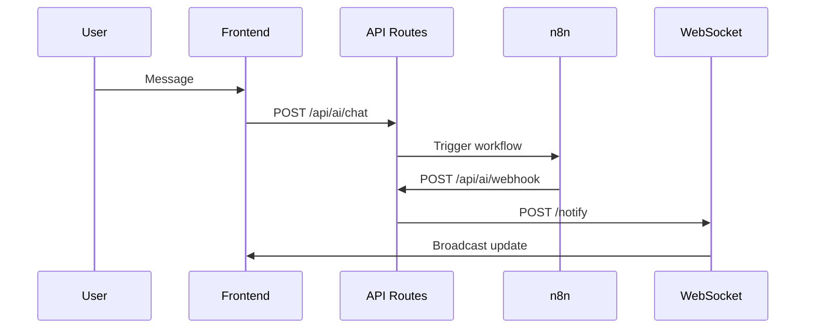

# 📡 Documentation WebSocket - GoalCraftAI

**⚠️ Note importante** : Cette documentation couvre l'architecture WebSocket générale. Pour l'implémentation actuelle avec n8n et les webhooks, voir [`webhook-api.md`](./webhook-api.md).

## 📋 Table des matières
1. [Vue d'ensemble](#vue-densemble)
2. [Architecture](#architecture)
3. [Serveur WebSocket](#serveur-websocket)
4. [Intégration avec les Webhooks](#intégration-webhooks)

## Vue d'ensemble

Le système WebSocket de GoalCraftAI utilise un serveur dédié (port 3002) pour la communication temps réel entre le backend et le frontend.

### Caractéristiques principales
- ✅ **Streaming en temps réel** des réponses IA
- ✅ **Reconnexion automatique** avec exponential backoff
- ✅ **File d'attente** des messages hors ligne
- ✅ **Système d'événements** pub/sub
- ✅ **Gestion robuste** des erreurs
- ✅ **Support des chunks** pour les longues réponses

## Architecture

Le système utilise un serveur WebSocket séparé qui reçoit des notifications des API Routes Next.js :

```
Next.js API Routes → POST /notify → WebSocket Server (3002) → Clients connectés
```

Structure actuelle :
```
frontend/src/
├── app/api/           # API Routes Next.js (backend)
│   ├── ai/
│   │   ├── chat/     # Endpoint chat
│   │   └── webhook/  # Réception webhooks n8n
│   ├── conversations/
│   └── objectives/
├── hooks/
│   └── useAIChatWS.ts # Hook WebSocket client
└── stores/
    └── objective-store.ts # Store Zustand
```

## Serveur WebSocket

Le serveur WebSocket (port 3002) reçoit des notifications HTTP des API Routes et les transmet aux clients connectés.

### Notifications reçues (POST /notify)

Voir [`webhook-api.md`](./webhook-api.md#notifications-websocket) pour la liste complète des types de notifications.

## Intégration avec les Webhooks

Le flux actuel utilise n8n et les webhooks :



## Utilisation Frontend

### Hook principal `useAIChatWS`

```typescript
import { useAIChatWS } from '@/hooks/useAIChatWS'

function ChatComponent() {
  const {
    messages,
    isLoading,
    isConnected,
    sendMessage,
    conversationId
  } = useAIChatWS({
    onObjectiveGenerated: (objective) => {
      // Callback quand un objectif est généré
    }
  })

  return (
    <div>
      {messages.map(msg => (
        <div key={msg.id}>
          {msg.role}: {msg.content}
        </div>
      ))}
    </div>
  )
}
```
          Arrêter la génération
        </button>
      )}
    </div>
  )
}
```

### 3. Store Zustand

```typescript
import { useChatStore } from '@/stores/chat-store'

function ConversationManager() {
  const {
    conversations,
    createConversation,
    addMessage,
    getCurrentConversation
  } = useChatStore()

  // Créer une nouvelle conversation
  const handleNewChat = () => {
    const id = createConversation("Nouvel objectif")
  }

  // Ajouter un message
  const handleAddMessage = () => {
    addMessage(conversationId, {
      id: Date.now().toString(),
      role: 'user',
      content: 'Message',
      timestamp: new Date()
    })
  }
}
```

## Implémentation Backend

### Structure des messages WebSocket

```typescript
// Message standard
{
  id: "unique-id",
  type: "AI_MESSAGE_CHUNK",
  timestamp: 1234567890,
  data: {
    messageId: "msg-123",
    content: "Voici ",
    isComplete: false
  },
  metadata: {
    userId: "user-456",
    sessionId: "session-789"
  }
}
```

### Exemple serveur Node.js/Express

```typescript
import { WebSocketServer } from 'ws'
import { OpenAI } from 'openai'

const wss = new WebSocketServer({ port: 3001 })
const openai = new OpenAI()

wss.on('connection', (ws) => {
  console.log('Client connected')
  
  ws.on('message', async (data) => {
    const message = JSON.parse(data.toString())
    
    switch (message.type) {
      case 'USER_MESSAGE':
        await handleUserMessage(ws, message)
        break
      case 'GENERATE_OBJECTIVE':
        await handleGenerateObjective(ws, message)
        break
    }
  })
})

async function handleUserMessage(ws, message) {
  const messageId = generateId()
  
  // 1. Envoyer "IA réfléchit"
  ws.send(JSON.stringify({
    id: generateId(),
    type: 'AI_THINKING',
    timestamp: Date.now(),
    data: {}
  }))
  
  // 2. Commencer le streaming
  ws.send(JSON.stringify({
    id: generateId(),
    type: 'AI_MESSAGE_START',
    timestamp: Date.now(),
    data: { messageId }
  }))
  
  // 3. Stream OpenAI
  const stream = await openai.chat.completions.create({
    model: 'gpt-4',
    messages: [{ role: 'user', content: message.data.content }],
    stream: true
  })
  
  // 4. Envoyer les chunks
  for await (const chunk of stream) {
    const content = chunk.choices[0]?.delta?.content || ''
    
    ws.send(JSON.stringify({
      id: generateId(),
      type: 'AI_MESSAGE_CHUNK',
      timestamp: Date.now(),
      data: {
        messageId,
        content
      }
    }))
  }
  
  // 5. Fin du message
  ws.send(JSON.stringify({
    id: generateId(),
    type: 'AI_MESSAGE_END',
    timestamp: Date.now(),
    data: {
      messageId,
      isComplete: true,
      stopReason: 'complete'
    }
  }))
}
```

## Gestion des erreurs

### Côté client

```typescript
// Dans le hook
useEffect(() => {
  const unsubError = on(WSEventType.ERROR, (error) => {
    if (error.retryable) {
      // Réessayer automatiquement
      setTimeout(() => retry(), 3000)
    } else {
      // Afficher l'erreur à l'utilisateur
      toast.error(error.message)
    }
  })
  
  const unsubDisconnect = on('disconnected', () => {
    // Le service gère la reconnexion automatiquement
    console.log('Déconnecté, reconnexion en cours...')
  })
  
  return () => {
    unsubError()
    unsubDisconnect()
  }
}, [])
```

### Codes d'erreur

| Code | Description | Retryable |
|------|-------------|-----------|
| `RATE_LIMIT` | Limite de taux dépassée | ✅ Oui (avec délai) |
| `INVALID_MESSAGE` | Format de message invalide | ❌ Non |
| `AUTH_FAILED` | Authentification échouée | ❌ Non |
| `GENERATION_FAILED` | Échec de génération IA | ✅ Oui |
| `TIMEOUT` | Timeout de la requête | ✅ Oui |
| `SERVER_ERROR` | Erreur serveur | ✅ Oui |

## Exemples de code

### Configuration personnalisée

```typescript
// Configuration avancée du service
const ws = getWebSocketService({
  url: process.env.NEXT_PUBLIC_WS_URL || 'ws://localhost:3001',
  reconnect: true,
  reconnectAttempts: 5,
  reconnectDelay: 1000,      // Délai initial
  reconnectDelayMax: 30000,  // Délai maximum
  reconnectDecay: 1.5,       // Facteur d'augmentation
  timeout: 20000,             // Timeout de connexion
  pingInterval: 30000,       // Interval de ping
  debug: process.env.NODE_ENV === 'development'
})
```

### Gestion du streaming complet

```typescript
function StreamingChat() {
  const [streamedContent, setStreamedContent] = useState('')
  const { on } = useWebSocket()
  
  useEffect(() => {
    let currentContent = ''
    
    // Début du streaming
    const unsubStart = on(WSEventType.AI_MESSAGE_START, () => {
      currentContent = ''
      setStreamedContent('')
    })
    
    // Réception des chunks
    const unsubChunk = on(WSEventType.AI_MESSAGE_CHUNK, (data) => {
      currentContent += data.content
      setStreamedContent(currentContent)
    })
    
    // Fin du streaming
    const unsubEnd = on(WSEventType.AI_MESSAGE_END, (data) => {
      if (data.stopReason === 'user_cancelled') {
        setStreamedContent(currentContent + ' [Annulé]')
      }
    })
    
    return () => {
      unsubStart()
      unsubChunk()
      unsubEnd()
    }
  }, [])
  
  return <div>{streamedContent}</div>
}
```

### Annulation de génération

```typescript
function GenerationControl() {
  const { generateObjective, stopGeneration } = useWebSocket()
  const [generationId, setGenerationId] = useState<string | null>(null)
  
  const handleGenerate = () => {
    const id = generateObjective("Apprendre le piano", {
      difficulty: 'intermediate',
      category: 'music'
    })
    setGenerationId(id)
  }
  
  const handleCancel = () => {
    if (generationId) {
      stopGeneration(generationId)
      setGenerationId(null)
    }
  }
  
  return (
    <>
      <button onClick={handleGenerate}>Générer</button>
      {generationId && (
        <button onClick={handleCancel}>Annuler</button>
      )}
    </>
  )
}
```

## Tests

### Test de connexion

```typescript
// Test unitaire
describe('WebSocketService', () => {
  it('should reconnect automatically', async () => {
    const ws = new WebSocketService({ 
      url: 'ws://localhost:3001',
      reconnectDelay: 100 
    })
    
    await ws.connect()
    expect(ws.isConnected).toBe(true)
    
    // Simuler une déconnexion
    ws.disconnect()
    expect(ws.isConnected).toBe(false)
    
    // Attendre la reconnexion
    await new Promise(resolve => setTimeout(resolve, 200))
    expect(ws.isConnected).toBe(true)
  })
})
```

## Monitoring

### Métriques à surveiller

- **Latence des messages** : Temps entre envoi et réception
- **Taux de reconnexion** : Nombre de reconnexions par session
- **Durée de streaming** : Temps moyen de génération
- **Taille des messages** : Octets transférés
- **Erreurs** : Types et fréquence

### Dashboard de monitoring

```typescript
function WebSocketMonitor() {
  const { connectionState, ws } = useWebSocket()
  
  return (
    <div>
      <p>État: {connectionState}</p>
      <p>File d'attente: {ws.queueSize}</p>
      <p>Connecté: {ws.isConnected ? '✅' : '❌'}</p>
    </div>
  )
}
```

## Sécurité

### Bonnes pratiques

1. **Authentification** : Valider le JWT à la connexion
2. **Rate limiting** : Limiter les messages par utilisateur
3. **Validation** : Valider tous les messages entrants
4. **Sanitization** : Nettoyer le contenu avant affichage
5. **Timeout** : Limiter la durée des connexions inactives

### Exemple d'authentification

```typescript
// Backend
wss.on('connection', async (ws, req) => {
  const token = req.headers.authorization?.split(' ')[1]
  
  try {
    const user = await verifyJWT(token)
    ws.userId = user.id
  } catch {
    ws.close(1008, 'Unauthorized')
    return
  }
})
```

---

📚 **Ressources supplémentaires**
- [WebSocket API MDN](https://developer.mozilla.org/en-US/docs/Web/API/WebSocket)
- [Socket.io Alternative](https://socket.io/)
- [ws Package Documentation](https://github.com/websockets/ws)