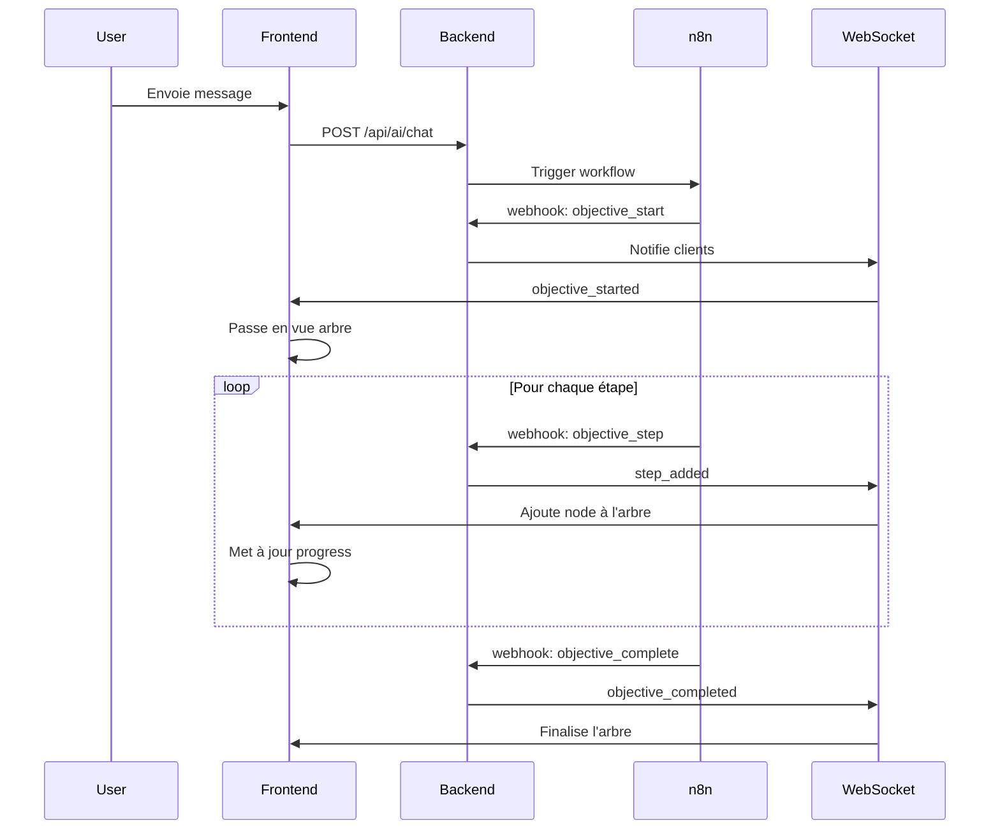
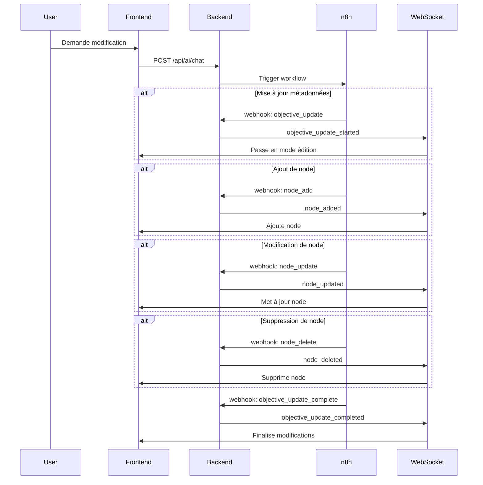

# Documentation API Webhook - GoalCraftAI

## Vue d'ensemble

L'API Webhook permet à n8n (ou tout autre service) d'envoyer des mises à jour en temps réel concernant la génération et la modification d'objectifs. Le système utilise WebSocket pour une communication bidirectionnelle instantanée avec le frontend.

## Configuration

### Variables d'environnement requises

```env
# Backend
N8N_WEBHOOK_SECRET=votre_secret_webhook_ici
MONGODB_URI=mongodb+srv://...
WEBSOCKET_PORT=3002

# Frontend
NEXT_PUBLIC_WS_URL=ws://localhost:3002
```

## Endpoint Webhook

**URL**: `/api/ai/webhook`  
**Méthode**: `POST`  
**Headers requis**:
- `x-webhook-secret`: Secret partagé avec n8n pour la sécurité

## Routage Intelligent

Le système route automatiquement vers différents agents n8n selon le contexte :

### Pas d'objectif existant → Agent Création
- **Webhook** : Configuré via `N8N_CREATION_WEBHOOK_URL`
- **Reçoit** : Message utilisateur + contexte de base
- **Mission** : Générer un nouvel objectif complet de A à Z

### Objectif existant → Agent Modification/Décision
- **Webhook** : Configuré via `N8N_MODIFICATION_WEBHOOK_URL`
- **Reçoit** : Message utilisateur + objectif complet actuel
- **Mission** : L'IA décide si elle doit :
  - Modifier l'objectif existant (node_add, node_update, node_delete)
  - Remplacer complètement l'objectif (objective_start)
  - Simplement discuter (message)

### Configuration des webhooks
```env
# Agent de création (pas d'objectif existant)
N8N_CREATION_WEBHOOK_URL=https://n8n.larefonte.store/webhook/creation-xxx

# Agent de modification/décision (objectif existant)
N8N_MODIFICATION_WEBHOOK_URL=https://n8n.larefonte.store/webhook/modification-xxx

# Fallback si les autres ne sont pas définis
N8N_WEBHOOK_URL=https://n8n.larefonte.store/webhook/default
```

## Types de Webhook

### 1. Messages de Chat

#### `message`
Message de réponse de l'IA dans le chat.

```json
{
  "conversationId": "conv_123",
  "type": "message",
  "content": "Voici ma réponse à votre question...",
  "isFinal": true
}
```

### 2. Génération d'Objectif

#### `objective_start`
Début de la création d'un nouvel objectif.

```json
{
  "conversationId": "conv_123",
  "type": "objective_start",
  "objectiveMetadata": {
    "title": "Apprendre la guitare",
    "description": "Maîtriser les bases de la guitare acoustique",
    "category": "musique",
    "difficulty": "intermediate",
    "estimatedDuration": "6 mois"
  }
}
```

#### `objective_step`
Ajout d'une étape dans l'objectif en cours de création.

```json
{
  "conversationId": "conv_123",
  "type": "objective_step",
  "step": {
    "id": "step_1",
    "title": "Apprendre les accords de base",
    "description": "Maîtriser Do, Ré, Mi, Fa, Sol, La, Si",
    "category": "main",
    "xpReward": 50,
    "estimatedTime": "2 semaines",
    "dependencies": [],
    "position": { "x": 100, "y": 100 },
    "milestones": [
      {
        "id": "m1",
        "title": "Maîtriser l'accord de Do",
        "completed": false
      }
    ],
    "tools": ["YouTube", "Ultimate Guitar"],
    "tips": "Pratiquer 15 minutes par jour minimum"
  },
  "isLastStep": false,
  "generationProgress": 25
}
```

#### `objective_complete`
Fin de la génération de l'objectif.

```json
{
  "conversationId": "conv_123",
  "type": "objective_complete"
}
```

### 3. Modification d'Objectif

#### `objective_update`
Début de modification des métadonnées d'un objectif existant.

```json
{
  "conversationId": "conv_123",
  "type": "objective_update",
  "objectiveMetadata": {
    "title": "Apprendre la guitare électrique",
    "estimatedDuration": "8 mois"
  }
}
```

#### `node_add`
Ajout d'un nouveau node à un objectif existant.

```json
{
  "conversationId": "conv_123",
  "type": "node_add",
  "step": {
    "id": "step_new",
    "title": "Apprendre les gammes pentatoniques",
    "description": "Maîtriser les 5 positions de la gamme pentatonique",
    "category": "bonus",
    "xpReward": 75,
    "estimatedTime": "3 semaines",
    "dependencies": ["step_1", "step_2"],
    "position": { "x": 300, "y": 200 }
  }
}
```

#### `node_update`
Modification d'un node existant.

```json
{
  "conversationId": "conv_123",
  "type": "node_update",
  "step": {
    "id": "step_1",
    "title": "Apprendre les accords barrés",
    "xpReward": 100,
    "dependencies": ["step_0"],
    "estimatedTime": "4 semaines"
  }
}
```

#### `node_delete`
Suppression d'un node.

```json
{
  "conversationId": "conv_123",
  "type": "node_delete",
  "step": {
    "id": "step_5"
  }
}
```

#### `objective_update_complete`
Fin de la modification de l'objectif.

```json
{
  "conversationId": "conv_123",
  "type": "objective_update_complete"
}
```

## Flux de Communication

### 1. Génération d'un nouvel objectif



### 2. Modification d'un objectif existant



## Gestion des États

### États de conversation

- `waiting`: En attente de réponse
- `processing`: Traitement en cours
- `generating_objective`: Génération d'objectif
- `updating_objective`: Modification d'objectif
- `completed`: Terminé

### États d'objectif

- `generating`: En cours de génération/modification
- `active`: Objectif actif
- `completed`: Objectif complété
- `archived`: Archivé

## Notifications WebSocket

Le serveur WebSocket (port 3002) transmet les notifications suivantes au frontend :

### Types de notifications

| Type | Description | Données |
|------|-------------|---------|
| `message` | Message chat | `content`, `isFinal`, `isThinking` |
| `objective_started` | Début génération | `objectiveId`, `objectiveMetadata` |
| `step_added` | Étape ajoutée | `step`, `isLastStep`, `generationProgress` |
| `objective_completed` | Génération terminée | `objective` |
| `objective_update_started` | Début modification | `metadata` |
| `node_added` | Node ajouté | `node` |
| `node_updated` | Node modifié | `nodeId`, `updates` |
| `node_deleted` | Node supprimé | `nodeId` |
| `objective_update_completed` | Modification terminée | `objectiveId` |

## Sécurité

### Validation du webhook

```typescript
// Vérification du secret
const webhookSecret = request.headers.get('x-webhook-secret')
if (!verifyWebhookSecret(webhookSecret)) {
  return NextResponse.json(
    { error: "Unauthorized" },
    { status: 401 }
  )
}
```

### Chiffrement des messages

Les messages sensibles sont chiffrés dans la base de données :

```typescript
import { encrypt, decrypt } from '@/lib/server/encryption'

// Chiffrement
const encryptedContent = encrypt(message.content)

// Déchiffrement
const decryptedContent = decrypt(encryptedMessage)
```

## Gestion des Erreurs

### Codes de réponse

- `200 OK`: Webhook traité avec succès
- `400 Bad Request`: Données invalides
- `401 Unauthorized`: Secret invalide
- `404 Not Found`: Conversation non trouvée
- `500 Internal Server Error`: Erreur serveur

### Format d'erreur

```json
{
  "error": "Message d'erreur",
  "details": "Détails supplémentaires"
}
```

## Données envoyées à n8n

### Structure du webhook body enrichi

```javascript
{
  // Identifiants de base
  "messageId": "msg-xxx",
  "userId": "user-123",
  "conversationId": "conv-abc",
  
  // Message et contexte
  "message": "Je veux modifier mon objectif",
  "objectiveType": "fitness",
  "messageCount": 5,
  
  // NOUVEAU : Informations sur l'objectif existant
  "hasExistingObjective": true,  // false si nouveau
  "existingObjectiveId": "obj-123", // null si nouveau
  "currentObjective": {  // null si nouveau
    "title": "Perdre 10kg",
    "skillTree": {
      "nodes": [...],
      "edges": [...]
    },
    // ... tout l'objectif complet
  },
  
  // Contexte enrichi
  "context": {
    "userName": "John",
    "userEmail": "john@example.com",
    "previousMessages": [...],
    "isFirstMessage": false,
    "agentType": "modification"  // ou "creation"
  },
  
  "callbackUrl": "https://app.com/api/ai/webhook"
}
```

## Exemples d'Utilisation

### Exemple 1 : Première conversation (Agent Création)

```javascript
// L'app détecte : pas d'objectif → Route vers Agent Création
// POST vers N8N_CREATION_WEBHOOK_URL
{
  "message": "Je veux apprendre la guitare",
  "hasExistingObjective": false,
  "currentObjective": null,
  "context": {
    "agentType": "creation"
  }
}

// L'agent création génère un nouvel objectif complet
```

### Exemple 2 : Modification d'objectif (Agent Décision)

```javascript
// L'app détecte : objectif existe → Route vers Agent Modification
// POST vers N8N_MODIFICATION_WEBHOOK_URL
{
  "message": "Ajoute une étape pour les accords barrés",
  "hasExistingObjective": true,
  "currentObjective": {
    "title": "Apprendre la guitare",
    "skillTree": { /* ... */ }
  },
  "context": {
    "agentType": "modification"
  }
}

// L'agent décision analyse et décide : node_add
```

### Exemple complet de génération d'objectif

```javascript
// 1. Démarrer l'objectif
POST /api/ai/webhook
{
  "conversationId": "conv_abc123",
  "type": "objective_start",
  "objectiveMetadata": {
    "title": "Devenir développeur Full Stack",
    "category": "tech",
    "difficulty": "advanced"
  }
}

// 2. Ajouter des étapes
POST /api/ai/webhook
{
  "conversationId": "conv_abc123",
  "type": "objective_step",
  "step": {
    "id": "html_css",
    "title": "Maîtriser HTML/CSS",
    "xpReward": 100,
    "dependencies": []
  },
  "generationProgress": 20
}

// 3. Terminer la génération
POST /api/ai/webhook
{
  "conversationId": "conv_abc123",
  "type": "objective_complete"
}
```

### Exemple de modification

```javascript
// 1. Ajouter un node
POST /api/ai/webhook
{
  "conversationId": "conv_abc123",
  "type": "node_add",
  "step": {
    "id": "react_native",
    "title": "Apprendre React Native",
    "dependencies": ["react_basics"]
  }
}

// 2. Modifier un node
POST /api/ai/webhook
{
  "conversationId": "conv_abc123",
  "type": "node_update",
  "step": {
    "id": "react_basics",
    "title": "React.js Avancé",
    "xpReward": 150
  }
}

// 3. Terminer les modifications
POST /api/ai/webhook
{
  "conversationId": "conv_abc123",
  "type": "objective_update_complete"
}
```

## Architecture Frontend

### Stores Zustand

Le système utilise Zustand pour la gestion d'état :

```typescript
// objective-store.ts
interface ObjectiveStore {
  // Actions de génération
  startObjectiveGeneration(metadata)
  addNodeToObjective(node)
  completeObjectiveGeneration()
  
  // Actions de modification
  startObjectiveUpdate()
  updateNodeInObjective(nodeId, updates)
  deleteNodeFromObjective(nodeId)
  updateObjectiveMetadata(metadata)
  completeObjectiveUpdate()
}
```

### Hook WebSocket

```typescript
// useAIChatWS.ts
// Gère la connexion WebSocket et les messages
// Dispatch automatiquement les actions vers le store
```

### Changement de vue automatique

Le frontend passe automatiquement à la vue arbre lors :
- De la création d'un nouvel objectif (`objective_start`)
- Des modifications d'objectif (`objective_update`, `node_add`, etc.)

Pas de changement automatique pour :
- Les messages de chat normaux
- La navigation manuelle entre conversations

## Troubleshooting

### Problèmes courants

1. **Webhook 404** : Vérifier que le `conversationId` existe
2. **Unauthorized** : Vérifier le secret `N8N_WEBHOOK_SECRET`
3. **WebSocket déconnecté** : Vérifier que le serveur WS tourne sur le port 3002
4. **Modifications non appliquées** : Vérifier que l'objectif existe et est actif

### Logs utiles

```bash
# Backend
[Webhook] Type reçu: objective_start
[Webhook] Notification WebSocket pour step_added
[WS Server] Client connecté

# Frontend
[WS] Connecté au serveur
[WS] Nouveau node ajouté: Apprendre React
[ObjectivesPage] Passage à la vue arbre pour modification
```

## Support

Pour toute question ou problème :
- GitHub Issues : https://github.com/goalcraftai/issues
- Documentation n8n : https://docs.n8n.io