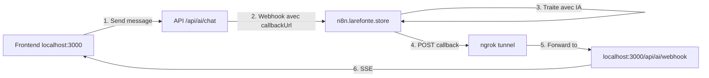

# Configuration ngrok pour le Développement Local

## 🌐 Pourquoi ngrok ?

n8n (hébergé sur `n8n.larefonte.store`) doit pouvoir appeler votre webhook local pour renvoyer les réponses de l'IA. 
Ngrok crée un tunnel sécurisé entre votre localhost et internet.

## 📦 Installation

### Windows
```bash
# Télécharger depuis https://ngrok.com/download
# Ou avec Chocolatey
choco install ngrok
```

### Mac/Linux
```bash
brew install ngrok
```

## 🔑 Configuration

1. **Créer un compte ngrok** (gratuit) : https://ngrok.com/signup
2. **Récupérer votre authtoken** depuis le dashboard
3. **Configurer ngrok** :
```bash
ngrok config add-authtoken YOUR_AUTH_TOKEN
```

## 🚀 Utilisation

### 1. Lancer Next.js
```bash
npm run dev
# Écoute sur http://localhost:3000
```

### 2. Lancer ngrok dans un autre terminal
```bash
ngrok http 3000
```

### 3. Récupérer l'URL publique
```
Session Status                online
Account                       your-email@example.com
Version                       3.5.0
Region                        Europe (eu)
Latency                       32ms
Web Interface                 http://127.0.0.1:4040
Forwarding                    https://c7e052301b37.ngrok-free.app -> http://localhost:3000
```

### 4. Mettre à jour `.env`
```env
SERVER_URL=https://c7e052301b37.ngrok-free.app
```

## 📡 Flow complet



## ⚠️ Important

- **URL change** : L'URL ngrok change à chaque redémarrage (sauf compte payant)
- **Mettre à jour `.env`** : Changer `SERVER_URL` à chaque fois
- **Headers ngrok** : n8n recevra des headers supplémentaires (`X-Forwarded-*`)

## 🔧 Configuration n8n

Dans votre workflow n8n, le webhook recevra :
```json
{
  "messageId": "msg-xxx",
  "conversationId": "conv-xxx",
  "callbackUrl": "https://c7e052301b37.ngrok-free.app/api/ai/webhook",
  "message": "...",
  "context": {...}
}
```

n8n doit faire un POST sur `callbackUrl` avec :
```json
{
  "messageId": "msg-xxx",
  "conversationId": "conv-xxx",
  "type": "message",
  "content": "Réponse de l'IA",
  "isFinal": false
}
```

## 🛡️ Sécurité

Pour sécuriser en production :
1. **Vérifier l'origine** : Ajouter un token secret
2. **Rate limiting** : Limiter les appels webhook
3. **Validation** : Vérifier messageId et conversationId

## 📊 Debug

Ngrok offre une interface web pour débugger :
```
http://127.0.0.1:4040
```

Vous y verrez :
- Toutes les requêtes reçues
- Headers et body
- Temps de réponse
- Erreurs éventuelles